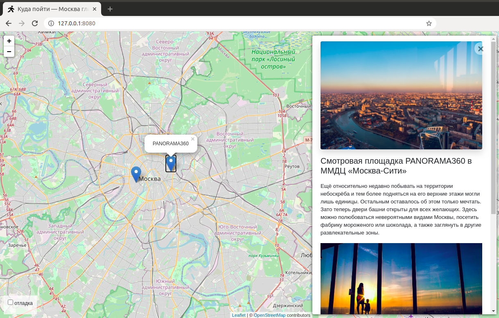

<p align="left">


</p>

# Куда пойти?

Проект на **Django** - карта с возможностью отмечать точки на ней. При клике на точку показывается дополнительная информация и катинки.



[Демка сайта](http://meshkovd.pythonanywhere.com/).

## Запуск и настройка


* Скачайте код
* Перейдите в каталог проекта с файлом `manage.py` и откройте терминал или консоль в данной папке.
* Установие зависимости проекта, введя в терминале команду  
>*рекомендуется предварительно активировать [виртуальное окружение](https://riptutorial.com/ru/django/example/3203/)*
```bash
$ pip install -r requrements.txt
```

* Откройте файл настроек проекта ``` settings.py ```  
Необходимо найти и настроить следующие опции:
```sh 
SECRET_KEY = os.getenv('SECRET_KEY')
...
ALLOWED_HOSTS = [os.getenv('ALLOWED_HOSTS')] 
```

>*Для тестовго запуска на локальном компьютере можете привести данные строчки к виду:*
```sh 
SECRET_KEY = "Your test secret key"
...
ALLOWED_HOSTS = []
```
>*Информация о SECRET_KEY: https://docs.djangoproject.com/en/3.1/ref/settings/#secret-key*

*При запуске проекта в боевом режиме рекомендуется, для хранения чувствительных настроек, воспользоваться переменными окружения. 
Проект уже настроен на работу с переменными окружения, для их использования в каталоге содержащем ```manage.py``` создайте файл ```.env```*

*Примерное содержимое файла ```.env```:*
```sh
SECRET_KEY='ikzt-5&i6x#(9gg(d6#n6e)089bv-5gox$wfhjqzptjdg45'
ALLOWED_HOSTS = 127.0.0.1
```

* Создайте суперпользователя
```bash
$ python3 manage.py createsuperuser
```
введите в консоли логин и паоль

* Проведите миграции.
Для этого в терминале введите:
```bash
$ python3 manage.py makemigrations
$ python3 manage.py migrate
```

* Теперь можно запустите веб-сервер.  
>*Для локального тестового запуса, качестве веб-сервера, используйте тестовый сервер Django:*

```bash
python3 manage.py runserver
```

* Откройте в браузере http://127.0.0.1:8000 и убедитесь, что приложение работает.
* Для добавления данных перейдите по адресу http://127.0.0.1:8000/admin/   

>*Введите пароль и логин суперпользователя, зарегистрированного ранее.  
Если вам необходимо добавить данные на уже работающий сайт, воспользуйтесь логином и паролем предоставленными администратором.*

* Теперь вы можете перейти в раздел "Места" и добавить новое место.  
>*Обратите внимание, что сортировку порядка показа фотографий можно регулировать перетаскивая фотографии мышкой.*

**Обратите внимание на возможность загружать новые места с помощью django-admin команды ```load_place <json_url>```  
В качестве аргумента команда принимает URL-адрес на страницу содержащую исключительно JSON**

```bash
python manage.py load_place https://roofs24.json
```

Страница должна содержать JSON вида:
```
{
    "title": "Антикафе Bizone",
    "imgs": [
        "https://raw.githubusercontent.com/devmanorg/where-to-go-places/master/media/1f09226ae0edf23d20708b4fcc498ffd.jpg",
        "https://raw.githubusercontent.com/devmanorg/where-to-go-places/master/media/6e1c15fd7723e04e73985486c441e061.jpg",
        "https://raw.githubusercontent.com/devmanorg/where-to-go-places/master/media/be067a44fb19342c562e9ffd815c4215.jpg",
        "https://Любой_URL_на_картинку.jpg"
    ],
    "description_short": "Настольные и компьютерные игр...",
    "description_long": "Рядом со станцией метро «Вой...",
    "coordinates": {
        "lng": "37.50169",
        "lat": "55.816591"
    }
}
```


## Используемые библиотеки

* [Django](https://www.djangoproject.com/) - веб-фреймворк Python высокого уровня, для быстрой разработки веб-приложений.
* [Leaflet](https://leafletjs.com/) - отрисовка карты
* [loglevel](https://www.npmjs.com/package/loglevel) - для логгирования
* [Bootstrap](https://getbootstrap.com/) - CSS библиотека
* [Vue.js](https://ru.vuejs.org/) - реактивные шаблоны на фронтенде
* [django-admin-sortable2](https://django-admin-sortable2.readthedocs.io) - упорядочивания перетаскиванием для сортировки объектов в виде списка в интерфейсе администратора Django.
* [django-tinymce](https://django-tinymce.readthedocs.io/) - виджет для отображения поля формы в качестве редактора.
* [python-dotenv](https://pypi.org/project/python-dotenv/) - чтение настроек из переменных окружения.
* [django-cleanup](https://pypi.org/project/django-cleanup/) - автоматически удаляет файлы для FileField, ImageField при удалении модели.


## Цели проекта

Код написан в учебных целях — это урок в курсе по Python и веб-разработке на сайте [Devman](https://dvmn.org).
